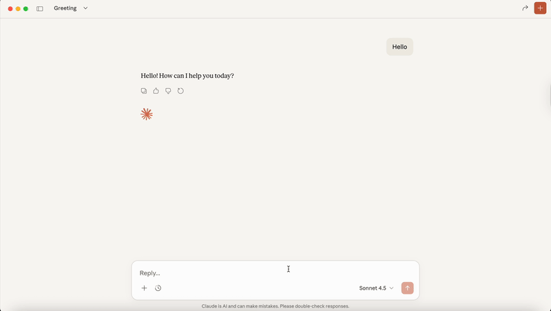
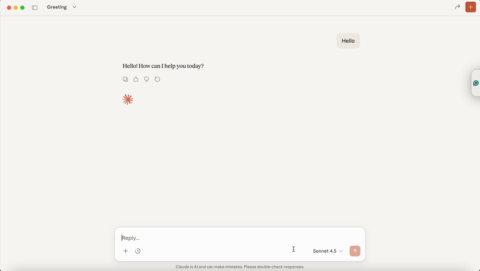
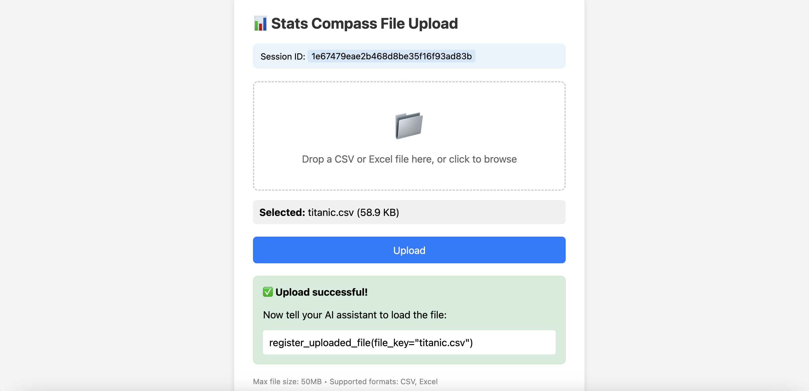

<!-- mcp-name: io.github.oogunbiyi21/stats-compass -->

<div align="center">
  
  
  # stats-compass-mcp
  
  **Turn your LLM into a data analyst.** Multiple data science tools via MCP.

  [](https://badge.fury.io/py/stats-compass-mcp)
  [](https://www.python.org/downloads/)
  [](https://opensource.org/licenses/MIT)
</div>



## Quick Start

```bash
pip install stats-compass-mcp
```

### Claude Desktop

```bash
stats-compass-mcp install --client claude
```

### VS Code (GitHub Copilot)

```bash
stats-compass-mcp install --client vscode
```

### Claude Code (CLI)

```bash
claude mcp add stats-compass -- uvx stats-compass-mcp run
```

> **Note:** The first connection may fail while `uvx` downloads the package. If this happens, disable and re-enable Stats Compass in your MCP settings — subsequent connections will be instant.

Restart your client and start asking questions about your data.

## What Can It Do?



| Category | Examples |
|----------|----------|
| **Data Loading** | Load CSV/Excel, sample datasets, list DataFrames |
| **Cleaning** | Drop nulls, impute, dedupe, handle outliers |
| **Transforms** | Filter, groupby, pivot, encode, add columns |
| **EDA** | Describe, correlations, hypothesis tests, data quality |
| **Visualization** | Histograms, scatter, bar, ROC curves, confusion matrix |
| **ML Workflows** | Classification, regression, time series forecasting |

Run `stats-compass-mcp list-tools` to see all available tools.

## How to Prompt

Start your message with **"Use stats compass to..."** — this tells the AI to use the Stats Compass tools instead of trying to write code or use other methods.

```
Use stats compass to load ~/Downloads/sales.csv and run EDA on it
Use stats compass to find my CSV files in Downloads
Use stats compass to clean the dataset and handle missing values
Use stats compass to create a histogram of the price column
Use stats compass to test if there's a significant difference in scores between group A and B
Use stats compass to train a classification model to predict churn
```

> **Tip:** Without this prefix, some AI clients may try to write Python code or use shell commands instead of the Stats Compass tools — especially for tasks like finding files on your machine.

## Loading Files

**Local mode:** Start with "Use stats compass to load..." and provide the file path or folder.

```
Use stats compass to load the CSV at ~/Downloads/sales.csv
Use stats compass to find my data files in ~/Documents
```

**Remote/HTTP mode:** Use the upload feature (see below).

## Remote Server Mode

For Docker deployments or multi-client setups:

```bash
stats-compass-mcp serve --port 8000
```

### File Uploads

When running remotely, users can upload files via browser:



```
You: I want to upload a file
AI: Open this link to upload: http://localhost:8000/upload?session_id=abc123

[Upload in browser]

You: I uploaded sales.csv
AI: ✅ Loaded sales.csv (1,000 rows × 8 columns)
```

### Downloading Results

Export DataFrames, plots, and trained models:

```
You: Save the cleaned data as a CSV
AI: ✅ Saved. Download: http://localhost:8000/exports/.../cleaned_data.csv
```

### Connect Clients to Remote Server

**VS Code** (native HTTP support):
```json
{
  "servers": {
    "stats-compass": { "url": "http://localhost:8000/mcp" }
  }
}
```

**Claude Desktop** (via [mcp-proxy](https://github.com/sparfenyuk/mcp-proxy)):
```json
{
  "mcpServers": {
    "stats-compass": {
      "command": "uvx",
      "args": ["mcp-proxy", "--transport", "streamablehttp", "http://localhost:8000/mcp"]
    }
  }
}
```

## Docker

```bash
docker run -p 8000:8000 -e STATS_COMPASS_SERVER_URL=https://your-domain.com stats-compass-mcp
```

## Client Compatibility

| Client | Status |
|--------|--------|
| Claude Desktop | ✅ Recommended |
| VS Code Copilot | ✅ Supported |
| Claude Code CLI | ✅ Supported |
| Cursor | ✅ Supported |
| GPT / Gemini | ⚠️ Partial |

## Configuration

| Variable | Default | Description |
|----------|---------|-------------|
| `STATS_COMPASS_PORT` | `8000` | Server port |
| `STATS_COMPASS_SERVER_URL` | `http://localhost:8000` | Base URL for upload/download links |
| `STATS_COMPASS_MAX_UPLOAD_MB` | `50` | Max upload size |

## Development

See [CONTRIBUTING.md](CONTRIBUTING.md) for development setup.

## 🙏 Credits

Landing page template by **ArtleSa** (u/ArtleSa)

## License

MIT
